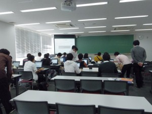
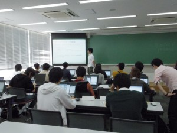
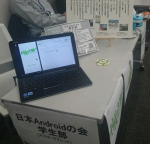

10月24日(土)に行われましたOSCでは、ハンズオンとブース出展しました。

【ハンズオン】
「Androidアプリを作成してみよう」ハンズオンでは、初学者向けにAndroid Studio を使ってHello World!からボタン配置のやり方、電卓アプリの制作を行いました！
講師、チューターは学生部メンバーで行いました。

【ブース】
今回はシューティングゲームを展示しました！
【OSCに参加した学生部メンバーの感想】
今後もアプリ開発に邁進したいと思います(新ゝ月)

初参加でしたがブース見学もハンズオンも楽しむことができました！(外丸 )

OSC初参加でした。また、私用により午後からの参加でしたが、コミュニティー/企業ブースのコンテンツが充実していたため、実のある時間を過ごせました。(木村)

ハンズオンが疲れました。初めてたくさんステッカーもらえて楽しかったです。 (武輪)

学生部のほつたです。初めてのOSCでハンズオン、ブース出展を無事みんなで力を合わせてやり遂げる事が出来て個人的にホっとしています。また、 OSCを通して学生部の結束力が更に強まったかなと感じています。次のこのようなイベントでも学生部みんなで力を合わせてやり遂げられたらと思います。(ほつた)

初OSCでした！楽しかったです♪OSCを機に新しいメンバーも増え嬉しいです。(鈴佳)

OSCは参加者に熱気の有る、開発者たちの良い交流の場でした。この度の学生部では積極的にハンズオン開催・ブース展開を行ってくださるメンバーが居り、OSCそのものだけではなく、学生部からも熱い熱気を感じることが出来、部内でも得るものは大きかったと感じています。OSCに関わった方々、お疲れ様でした！ &amp; ありがとうございます！(樋川)

当日は、学生部だけでなく外部からのサポートも手厚く、大変貴重な時間を過ごせたと思います。参加者のみなさんも真剣にコードを書いていて、負けてられないなと感じました。(木永)

ハンズオンやOSCに初めて参加して自分の知らないことを多く知れて良かったです(栗原)

&nbsp;

お疲れ様でした！

