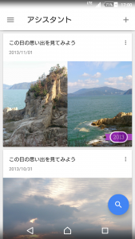
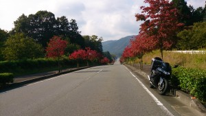
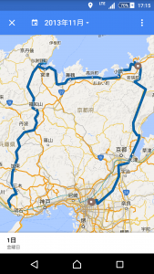

こんにちは、学生部の濱中です。

気持ちの良い秋晴れが続き、紅葉が綺麗な季節になりましたね。

みなさんはGoogleフォトを利用していますか？
Googleフォトの機能で「この日の思い出を見てみよう」というものがあり、数年前のその日の写真をピックアップしてくれる機能です。
↓こんな感じのやつです

この日はツーリングをしていた日でした。

景色がとても綺麗で懐かしく、また行きたくなりました。

「この日はどこに行ったんだっけ？」
と思うこともあるかと思いますがこんな時に便利な機能があります。
"タイムライン"という機能です。
Googleマップのアプリから開くことができます。

過去の位置情報を地図で見ることができます！
ツーリングによく行く私はこの時はどの道を通ったんだっけなと通った道まで知りたい時もあるのでとても便利に使っています。

Googleマップにはナビの機能もあるのでツーリングのお供に最適です。
位置情報や写真をGoogleに集約するといろいろ便利になりますね♪

話が変わりますが、
私は現在、Androidのメモリ管理の研究をしています。(主にGCについて)
メモリ管理方法についての記事を書こと思っていましたが一般向けのネタが不足していまして溜まったら記事を書きたいと思います。