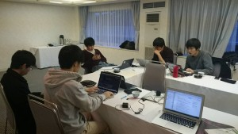
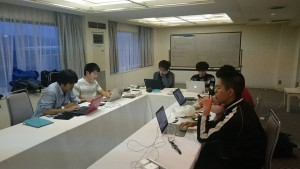

日本Androidの会学生部では2015年11月14日(土)～2015年11月15日(日)に大磯プリンスホテルにて開発合宿を行ないました。
部員13人が参加し、2つのチームに分かれビンゴゲームアプリを開発しました。
ほとんどのメンバーが集中力が続かずに初日の夜のお弁当が届くとすぐにみんな食べ終え、開発を休みました。
1日目の開発が終わった後、全員参加のLT大会を行いました。
そして、2日目には開発したアプリが完成し、ビンゴをしました!
みんなで開発したり交流したりとても充実した合宿になりました。
無事開発に区切りをつけられ締め括ることが出来たことにより学生部の力というものを発揮出来たのでは無いでしょうか。
非常に充実した開発合宿を通して、普段のミーティングやイベントよりも遥かに交友関係を深められたはずです。
今後の学生部の活動がより良い物に結び付く事かと思います。

参加した部員の感想

学生部初めての合宿ものすごく楽しかったです。開発中は雑談多かったけど、雑談しながらの開発って結構捗るってことに気づきました！合宿イベントはまた部内で企画立ち上げてやりたいなー。(鈴木久)

集中するときは集中して時に息抜きしてとメリハリのある合宿で楽しかったです。いろいろ教えてもらったり、調べたりしながらの開発でしたが今回の経験は自分の力になったと思います。(外丸)

大変有意義な時間を過ごせました。各自スキルアップやモチベーションアップなど価値のある時間を過ごせたようです。また機会があれば参加したいと思います。(古川)

OSCにて加入した新入りなので初の顔合わせになる方が多かったのですが、みなさん優しい方で安心しました。チームでの開発は大変でしたが、とても有意義な二日間でした。幹事の堀田くんに感謝です！(中山)

開発は分からないことだらけでしたが、自分の知らない知識を知るいい機会になりました。(栗原)

初開発合宿、初LT etc…と初めての事ばかりで、学ぶことが多く、実のある合宿になりました。(木村)

楽しかったです！合宿から学生部初参加は何名かいましたが、すぐ仲良くなってましたね。合宿を学生部恒例行事にしていきたいです！(鈴木佳)

まとまってAndroidの開発に時間が割ける機会があることは非常に有意義だなと感じました。ホテルも良いところでとても楽しかったです！(木永)

次回の開発合宿を学生部一同、楽しみにしていることでしょう。
次回の開発合宿が予定されれば、手ごろで今回よりも更に良い宿を見つけ開発合宿を行いたいですね。(ほつた)