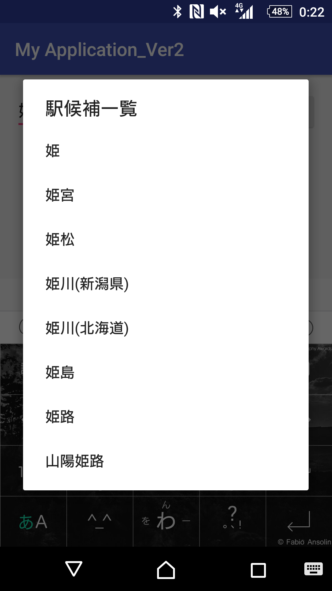
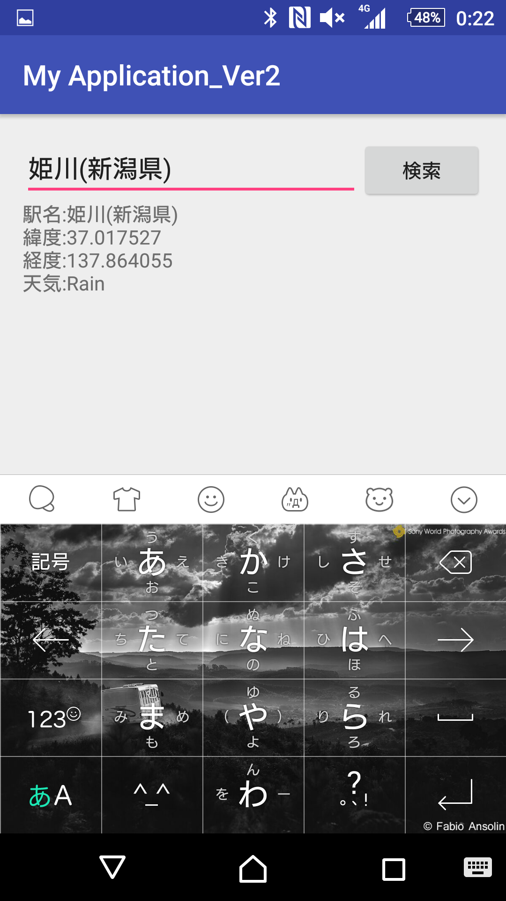
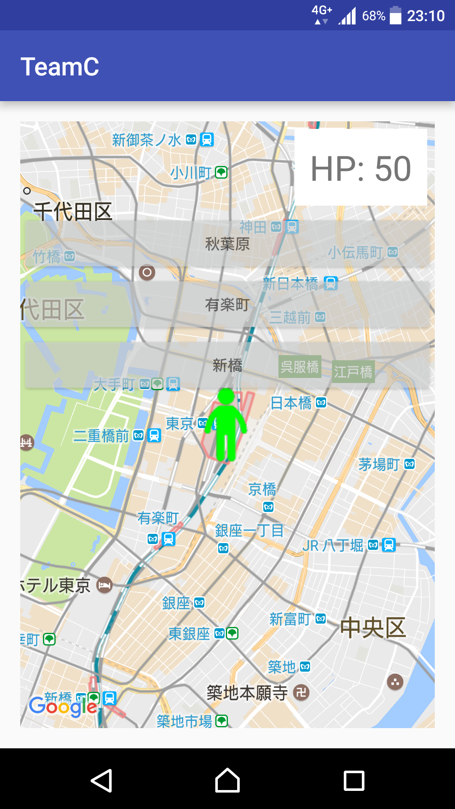
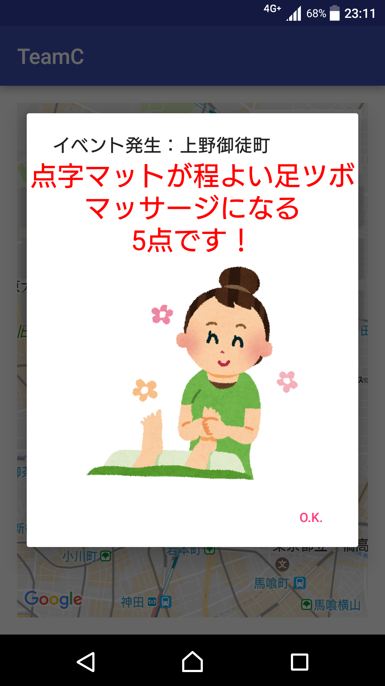
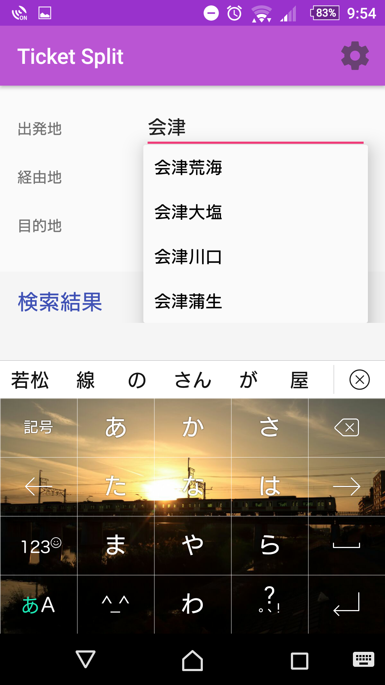
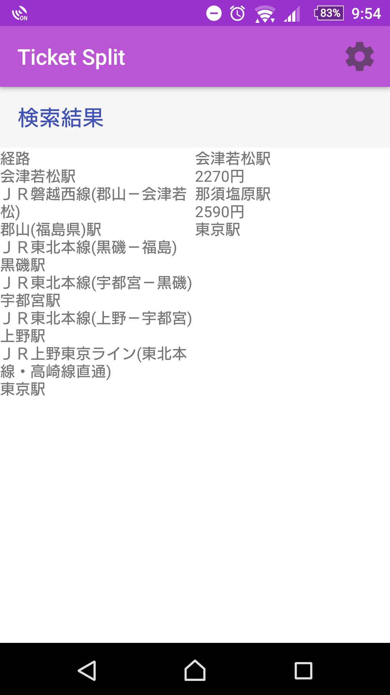
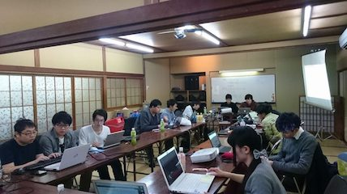
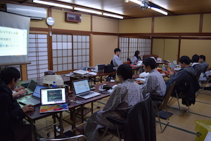
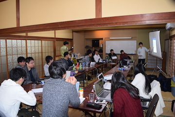
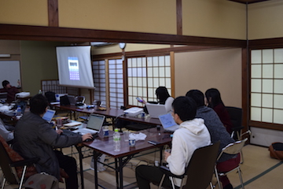

日本Androidの会学生部では2017年2月14日(土)～2017年2月15日(日)に熱海の芳仙閣様にて開発合宿を行ないました。
部員15人が参加し、1チームあたり3〜4人のチームに分かれてAndroidアプリケーションの開発を行いました。
合宿のお題は「Web APIを使ってみよう！」です。
今回の開発合宿で開発したアプリは3/18に秋葉原支部と共同開催する<a href="https://jagsa.connpass.com/event/50029/">「メイドさんと一緒に楽しく学ぶAndroidアプリ開発入門セミナー Web API編」</a>にてブラッシュアップしたものをお披露目します！

開発したアプリとそれぞれのチームの代表のコメントを紹介します。

<strong>チーム1</strong>
アピールポイント:
  駅候補が複数の時は一覧を表示し、選択できるようにしました。
感想:
  ほぼ初めてのアプリ開発でわからないことばかりでしたが、頑張りました。
(中村)

<strong>チーム2</strong>
アピールポイント:
  HPが0になるまでにどこまで行けるかを競うゲームアプリです！
感想:
  事前準備をしていたこともあり、去年よりも濃密な開発合宿になり、技術の向上にも繋がったと思います。
(外丸)

<strong>チーム3</strong>
アピールポイント:
  経由駅指定と、有料特急等の利用の有無を変更可能にした点
感想:
  自分は初めてのチーム開発でしたが、各々が協力して一つのものを作るという体験が出来ていい合宿になりました。
(星)

<strong>活動の様子</strong>
開発中...

発表

