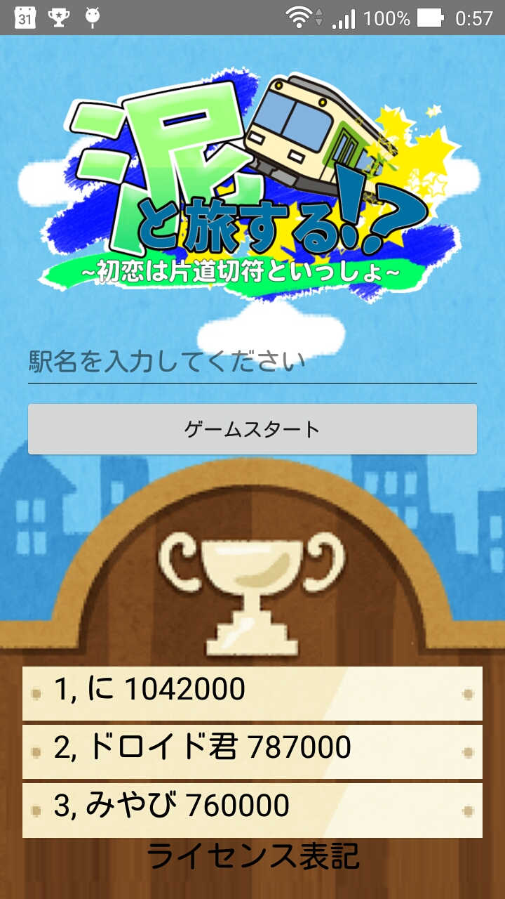

こんにちは、日本Androidの会学生部の木村です。

5/28 に東海大学高輪キャンパスで開催された<a href="http://abc.android-group.jp/2017s/">Android Buzzer And Conference 2017 (通称ABC2017s)</a>のバザールに出展しました。
今回の出展では、2月末から開発を進めていたAndroid上で動作するゲームアプリ「泥と旅する」を展示しました。
アプリ開発については、学生部メンバの技術力向上を目標に、初心者メンバを中心にプロジェクトを進める方針で進めました。
昨年の8月に入部した中村君をプロジェクトリーダに、コーディング班、リソース班に分かれて作成を進めました。

アプリを体験してくださった参加者から以下の感想をいただきました(一部抜粋)
<blockquote style="background-color:#fbfaf8;font-size:15px;">
初恋は片道切符と一緒って要素ないのでは？
自機アイコンを電車の絵にした方がいい
点数マイナスばっかだね
低い点数もランキングに乗ると良かった
</blockquote>
など、厳しい意見をいただいた一方で、アプリ開発の方針や、学生部の活動について多くの方に宣伝する機会となり大変有意義な時間となりました。
アプリについては感想、意見の取り入れやバグの修正等をした後、ストアにリリースする予定です。

また、プロジェクトの反省として
<ul>
	<li>初心者メンバーの環境設定、構築に時間がかかってしまったこと</li>
	<li>コーディング班の作業が過密であったことや、逆にリソース班の作業量が比較的少なかったこと</li>
	<li>特定メンバーに作業が集中してしまったこと</li>
</ul>
が上げられました。
次回以降のプロジェクトに活かしていきたいと思います。

最後に、プロジェクトリーダーの中村くんがABCの参加について、バザールを中心に当日の様子についてのブログ記事を公開してくれました。
http://blog.shirai.la/seminar/2017/05/abc2017s/
