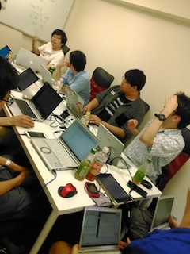

こんにちは、日本Androidの会学生部 木村です。

6/4に学生部の定例ミーティングの後の時間を使いKotlin勉強会を行いました。
Kotlinは5月のGoogle IOでAndroidのアプリ開発でのファーストクラスとなったプログラミング言語です。
当日は、部長の古川くんが進行役を行い、Kotlinでアプリを書きながら学習する方針で進めました。
アプリ開発の経験があるメンバがサポート役にまわり、Android Studioの扱いやプログラミングに慣れていないメンバのサポートを行いました。
また、先日発足したばかりの学生部長崎のメンバーにもハングアウトを通してリモートで参加ししていただきました。

勉強会の最後には次回ミーティングまでにそれぞれアプリを作る宿題もだされました。
どんなアプリができるのでしょうか。次回のミーティングが楽しみです！

勉強会の様子

