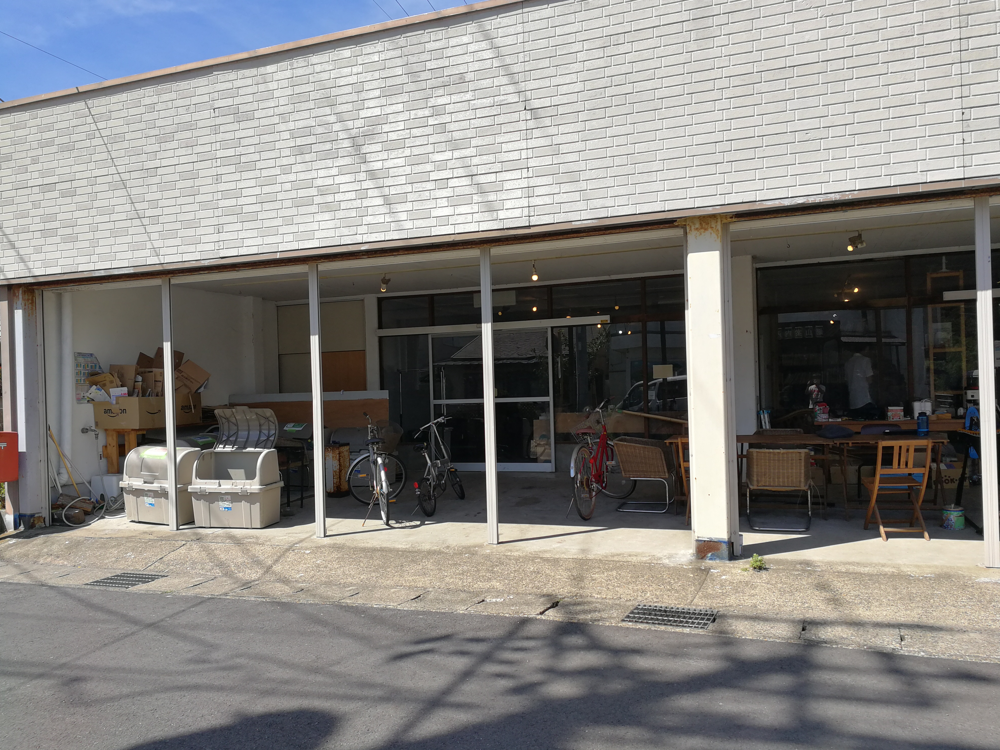
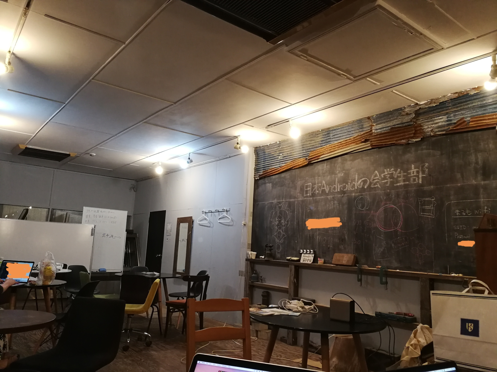
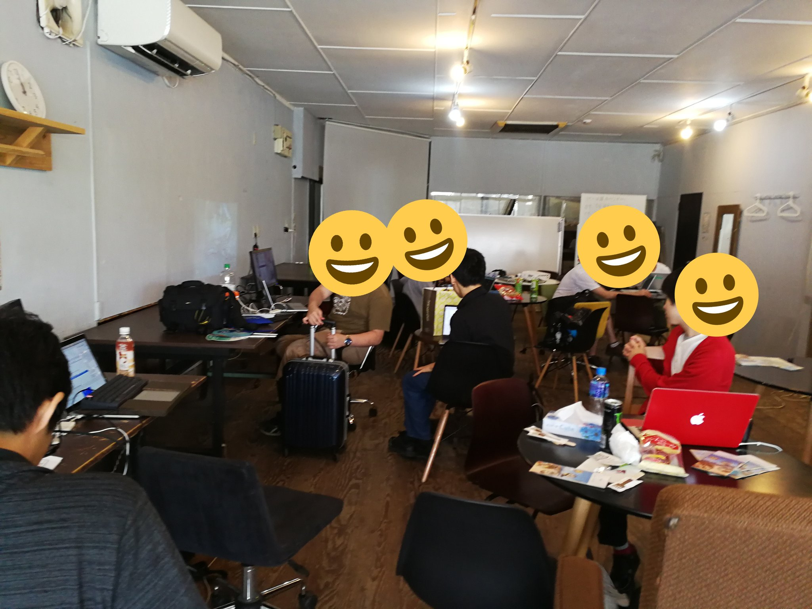
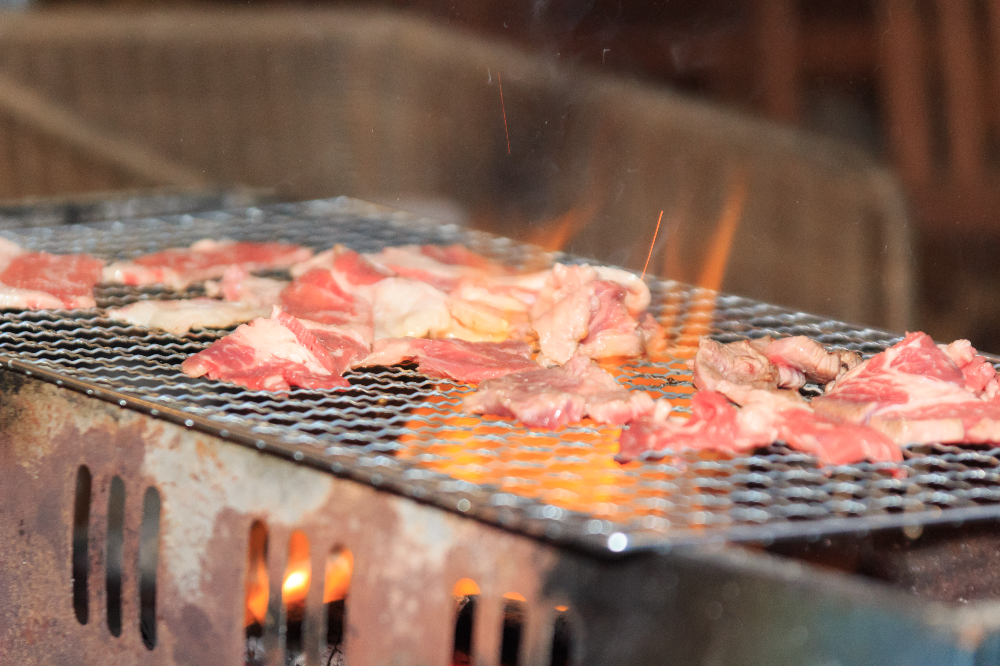
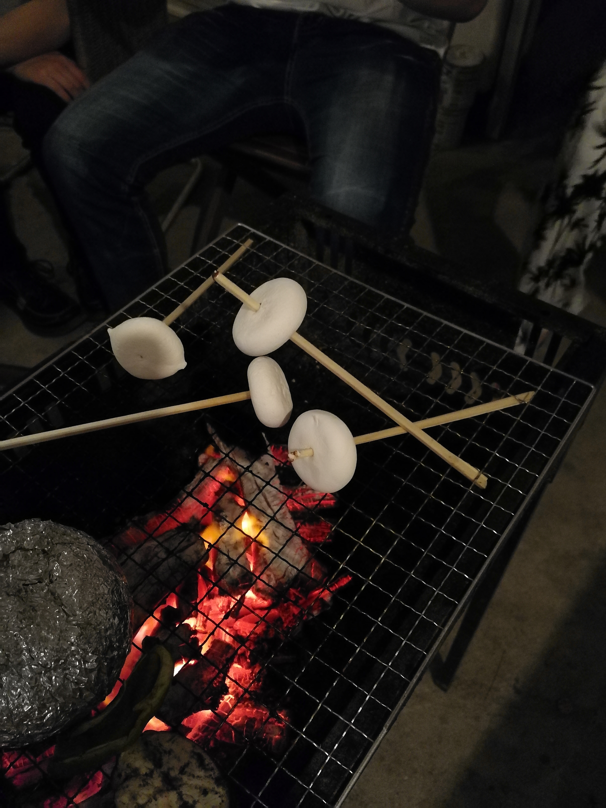

学生部の木村です。
8月に、日本Androidの会学生部の2018年度開発合宿を行いました。  
その時の様子を写真とともにお届けしたいと思います。  
学生が開発合宿を開催する際に参考にしていてだけると幸いです。

# 開催地, プラン
開催にあたって千葉県金谷にある「まるも」の開発合宿プランを利用しました!  
お宿の素泊まり + まるも(コワーキングスペースの一室貸し切り) + BBQ  
のプランを選択しました。

まるも: http://marumo.net/

# 大体のスケジュール

|  時  |  内容  |
| ---- | ---- |
|  11:00  |  定例ミーティング  |
|  12:00〜13:00  |  お昼休憩  |
|  13:00〜18:00  |  チームに別れて開発  |
|  18:00〜19:30  |  BBQ!  |
|  19:30  |  各自、開発/懇親/就寝  |
|  9:00〜11:30  |  開発  |
|  11:30〜12:00  |  進捗・成果報告  |
|  12:00  |  解散!  |

# 合宿の内容について

大きくわけて次の事を行いました。

- 定例ミーティング
- ハンズオン, 運営タスク消化
- メンバー間の交流

ハンズオン2チームと運営タスク消化チーム1チームに別れて作業を行いました。  
チームごとの作業内容については次のとおりです。

- ハンズオンチーム
 - Androidアプリ開発入門班
 - スマートスピーカースキル作成入門班
- 運営タスク消化班
 - ブログの整備
 - Googleドライブまわり整理

# 当日の様子

まるもの外観と中です。  
周りも落ち着いた雰囲気で集中して開発をするにはもってこいの環境です。

中はラフな作りになっていてオシャレです。  
モニター、電源、コーヒーなどの備品も充実していて快適な環境で開発を進めることができました。  
プロジェクターの用意もあったので、午前中に行った定例ミーティングもスムーズに進める事ができました!  

下の写真は開発中の様子です。 
3チームに分かれてそれぞれの課題を進めました!   

僕はお昼ご飯は向かいにあるビザ屋さん(Pizza GONZO)でピザをオーダーしました。  
ピザ屋さんのご好意で焼き立てのピザを合宿の会場まで運んでいただけました!  

金谷は他にも美味しいお店がいっぱいあるようです!
[昼食におすすめの飲食店リスト｜まるも｜金谷のコワーキングコミュニティ｜note](https://note.mu/marumo_space/n/nd0501f3ab8d7)

夕飯はマルモのプランでBBQをしました!  
BBQセットには機材や食材の提供まですべて含まれていて、スタッフの方が準備をしてくださったので、直前まで開発に集中できました!   

BBQの肉です。
  
火を見ながら技術話に花を咲かせました。  

初心者の技術力を高めると共に親睦を深めることができました。  
また、運営サイドのタスクも消化しました!  

まるものスタッフの方の手厚いサポートのおかげもあり、大変充実した2日間になりました!

# 参加者の感想

## チューター

- 開発初心者向けのハンズオンということだったので、教える側そして教わる側の両方の目線から分かりやすい資料を作ることを第一として資料作成にあたりました。当日は自分の環境では起こらなかったエラーなどもありましたが無事チュータとしてやりきることが出来、自分としても新しい発見やまだまだ知識不足を実感出来たりととても実りある開発合宿に出来たかなと思います。
- いつもと違って時間がたくさんあっていろいろな事が出来たのでよかった ハンズオン自体は1時間程度で終わるように作って、あとは自由開発にしたのもあってかハンズオンとしての成果ではなく学んだ事を使ったものをその場で作ることが出来たのもよかったとおもう

## その他の参加者

- GoogleHomeでのアプリ開発を知識ゼロから網羅的に学べたのが良かった。Googleがかなり気をつかって開発環境を整えてくれていたので敷居が思ったより低いと感じた。これをキッカケにアプリリリースまで挑戦してみたいです。
- 納期(時間)に縛られた開発が多い中、今回は時間に縛られず自由に開発できたので、楽しく和気あいあいとした開発合宿になりました。たまにはこのような開発も良かったのではないかと思います。
- 以前から課題であった，ブログの環境を改善，新しい仕組みを構築しました．コミュニティだと，こういった作業は中々進まないものですが，合宿のように集中できる環境でしたので成果を出せましたし満足しています．
- 今年の開発合宿は都心から離れた場所のコワーキングスペースで学生部のメンバーが集って開発をすることが出来て最高でした。
- 初参加でしたが、とても楽しく開発作業を体験出来ました。それぞれが興味や技能にあった課題を選び、作業に取り組めたので良かったです。また、1日目の作業時間が終了してからの夕食のBBQや温泉なども楽しく印象深いです。
- こうした合宿は初参加でしたが、とても楽しい合宿でした。興味のあることをより深めるもよし、基本的技術を学ぶもよし、幅広いことを行えることがよかったです。またこのような機会があるなら参加してみたいと思いました
- 学生部の情報管理について整理検討できた

