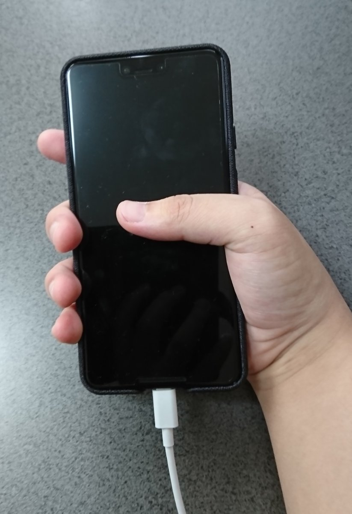

学生部の外丸です。  
11月1日に日本で発売されたPixel3 XLを購入してみました。  
ちょうど機種変更の時期だったということで、以前使用していたXperia X Performanceとの比較をしつつ感想をお届けしたいと思います。  

まずはそれぞれの簡単なカタログスペックから  

|  項目  |  Xperia X Performance※1  |  Pixel3 XL※2  |
| ---- | ---- |  ----  |
|  サイズ(高さ×幅×厚さ)  |  約144mm×約71mm×約8.6mm  |  158.0mm×76.7mm×7.9mm  |
|  ディスプレイ  |  約5.0インチ  |  6.3インチ  |
|  質量  |  約165g  |  184g  |
|  電池容量  |  2570mAh  |  3430mAh  |
|  CPU  |  2.2GHz＋1.6GHz クアッドコア  |  2.5 GHz + 1.6 GHz オクタコア  |
|  メモリ(RAM)  |  3GB  |  4GB  |
|  メインカメラ  |  有効画素数約2300万画素  |  12.2 メガピクセル（デュアル ピクセル）  | 

※1:Xperia X Performance SO-04H|主な使用|ソニーモバイルコミュニケーションズ、https://www.sonymobile.co.jp/xperia/docomo/so-04h/spec.html より引用  
※2:Pixel 3 の仕様を比較 - カメラ、画面、電池、プロセッサ - Googleストア、https://store.google.com/jp/product/pixel_3_specs より引用  
より詳しいスペックを知りたい人は公式ホームページへお願いします。  

まず気になるのは大きさですが、実際に持ってみるとこんな感じになります。  

正直に言うと少々大きいですね…  
Pixel3(無印)くらいのほうが普段遣いにちょうど良さそうです。    

続いてアプリの起動速度についてですが、今回はよく使うTwitterのアプリ(公式)で試してみました。  

|  Xperia X Performance  |  Pixel3 XL  |
| ---- | ---- |
|  約2.2秒  |  約0.9秒  |

もちろん環境によっても多少前後するでしょうが、非常に早くなったと感じます。

続いては気になるカメラの性能についてです。  
これはそれぞれで撮った写真を見てもらえば一目瞭然ですね。  

Xperia X Performance  
  

Pixel3 XL  
  

Pixel3 XLで撮ったほうはノイズも少なく非常にきれいでした。  

個人的に特に気になったところは上記の通りですが、最後にいろいろと感想をまとめてみます。  

# まとめ
【良かったところ】  
・カメラがとてもきれいな上に多機能  
・ディスプレイもとてもきれい  
・端末の起動/アプリの起動が非常に早い  
・電池持ちも良い  

【不満に思ったところ】  
・サイズが大きすぎた  
・値段が高い  

性能面に関しては特にこれと言った不満はありませんでした。  
総合的にはPixel3 XLに買い替えて良かったと思いました！  

※あくまで一個人の感想です。  
