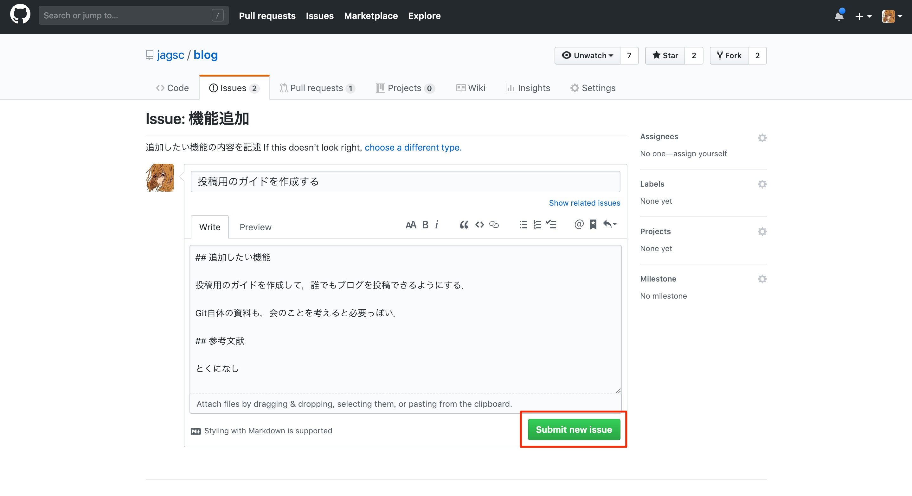

# Contribution Guide / Issue作成編

## はじめに

ブログをメンテナンス or 記事を執筆するにあたって，プルリクエストを送る必要があります．
その前にリポジトリのIssueという機能を使用して，「こういうブログ記事を書きたい」「こういった修正をしたい」「だれかコレ直して」といったこと宣言したり話し合ったりすることが一般的です．

ここには，そのIssueの作り方を示します．

## 環境

適宜準備してください

- GitHubに登録している

## 手順

### Issue作成画面を開く

> Issueは話題提起として気軽に作成することができます
> すでにあるIssuesの確認を行うことも可能ですので，内容が重複するものを作成することは避けましょう．

[https://github.com/jagsc/blog](https://github.com/jagsc/blog) にアクセスします．

そこで，画面上部の「Issues」をクリックします．

次に「New Issue」を選択します．

Issueの種類に合わせてボタンを選択します．

## Issueの内容を記述する

Issueの内容を埋めていきます．
例えば，以下のように記載します．
記載が終わり次第「Submit new Issue」をクリックすることで，作成が完了します．

## Issueの内容を確認する

このようにIssueが作成されたらOKです．

画面下部からコメントを行えますので，追加の情報があったらコメントするなり話し合うなりで使用することができます．

