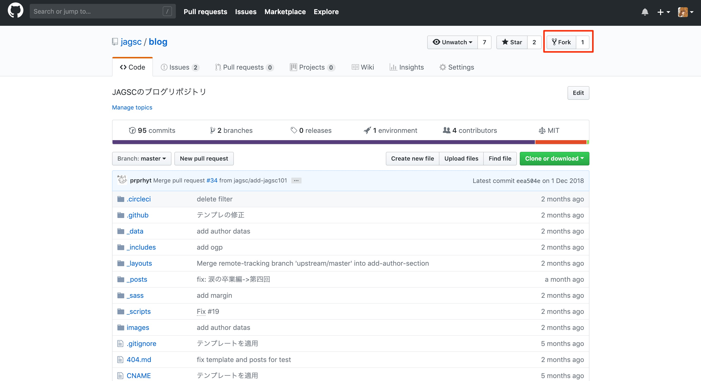
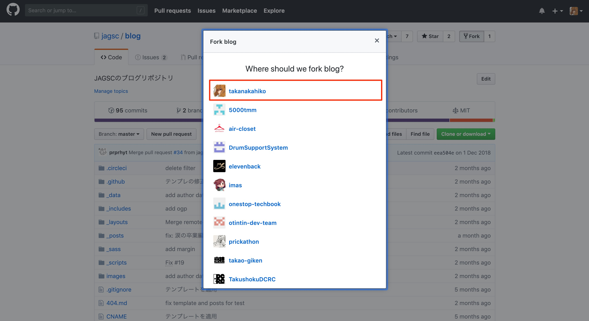
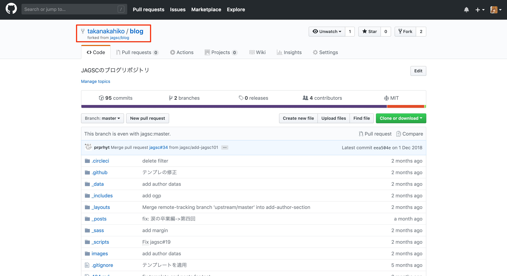
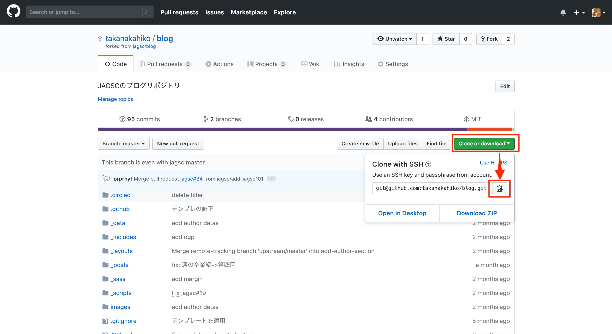
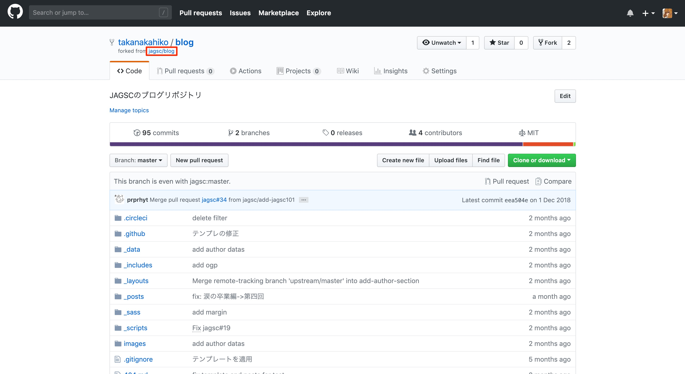
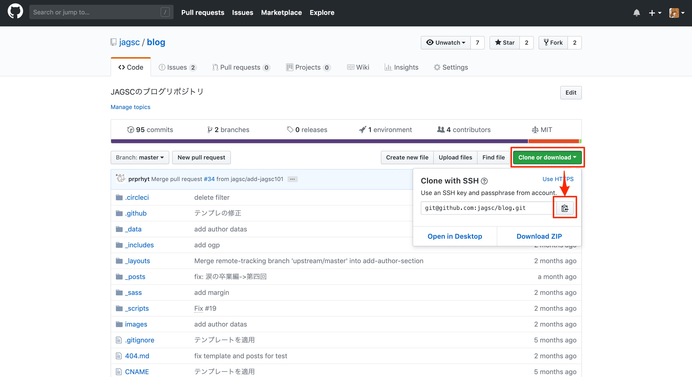

# Contribution Guide / プルリクエストの準備編

## はじめに

ブログをメンテナンス or 記事を執筆するにあたって，プルリクエストを送る必要があります．
最初のプルリクエストを送る前に，いくつか準備が必要です．

ここには，その手順を示します．

## 環境

適宜準備してください

- gitがインストールされている
- GitHubに登録している
- コマンドラインについて基本的な知識がある( `cd` や `ls` を扱える)

## 手順

### リポジトリをForkする

> jagsc/blog リポジトリは直接編集できません．
> 一度，Forkして自分用のリポジトリを作ることで編集ができます．

[https://github.com/jagsc/blog](https://github.com/jagsc/blog) にアクセスします．

そこで，画面右上の「Fork」をクリックします．



その後，自分のアカウントを選択することでForkすることができます．



Forkしたら，**Fork先のリポジトリ**に移動するはずです．
`あなたのID/blog` というリポジトリ名になっていることを確認してください．



### Fork先のリポジトリをcloneする

> **Fork先のリポジトリ**を自分のPCにcloneし，ローカルリポジトリを用意します

**Fork先のリポジトリ**(`あなたのID/blog`)のページにアクセスし，「Clone or download」→「copy」を選択し，clone用のurlをコピーします．



次に，手元のPCで clone します．
以下のコマンドを手元のターミナルで実行します．

```bash
# cloneしたいディレクトリに移動(例: `cd ~/github` )
$ cd %cloneしたいディレクトリのパス%

# cloneする
$ git clone %コピーしたURL%

# リポジトリ内に移動する
$ cd blog
```

`clone` ができているはずです．`ls`コマンド等で,リポジトリの内容が正しく`clone`できているか確認してください．

### upstreamの設定をする

> clone後に**Frok元のリポジトリ**が変更された際に，手元のリポジトリの内容が古いものとなってしまいます．
> それを防ぐため，**Frok元のリポジトリ**のURLを登録することで追従を行えるようにします．

まずは**Frok元のリポジトリ**(jagsc/blog)のページにアクセスます．



「Clone or download」→「copy」を選択し，clone用のurlをコピーします．



次に，以下のコマンドを手元のターミナルで実行します．

```bash
$ git remote add upstream %コピーしたURL%
```

メモ:帰りに人参を買う
