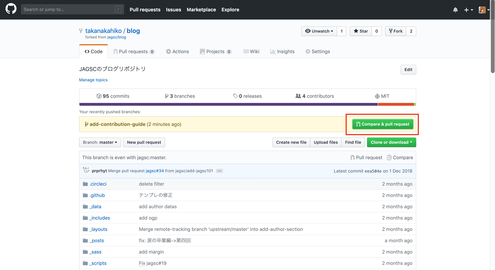
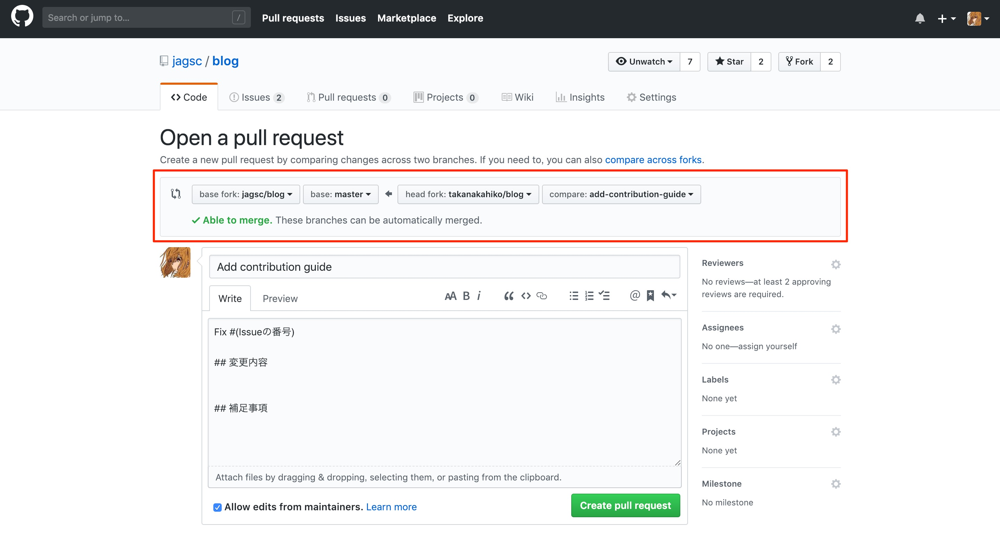
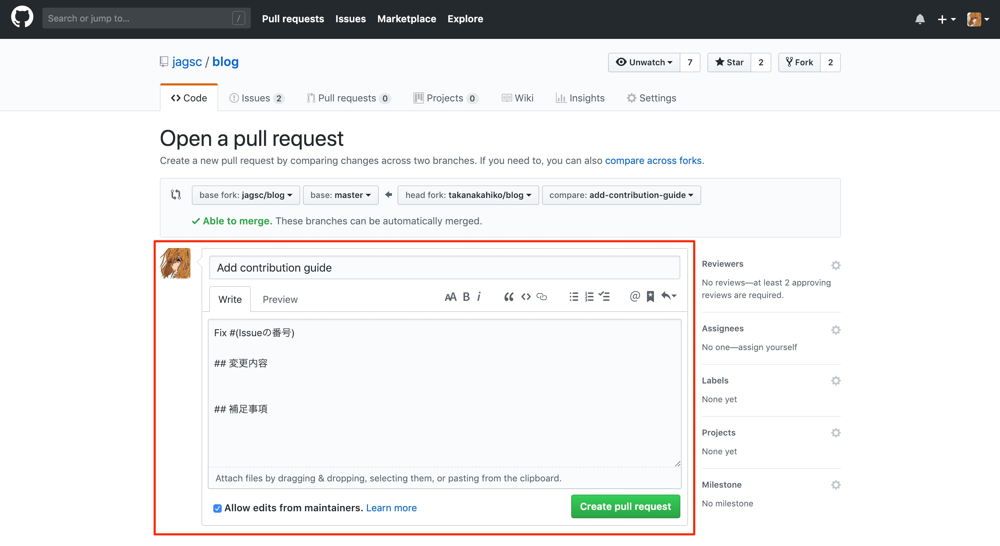
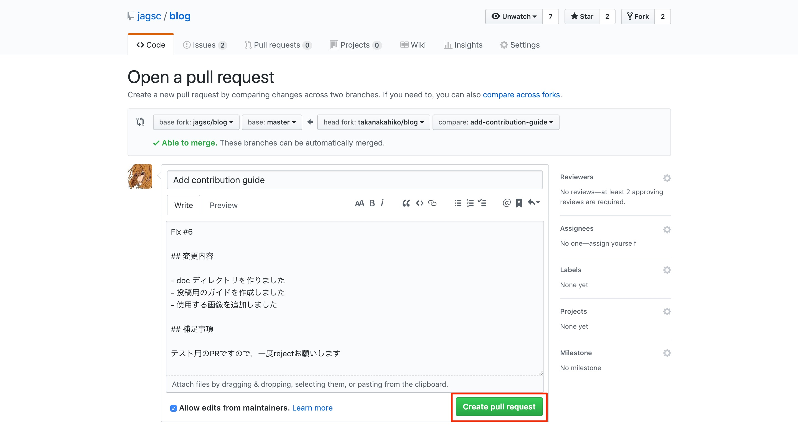
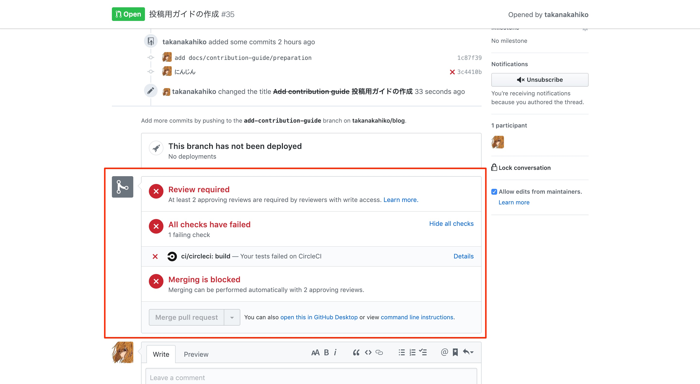
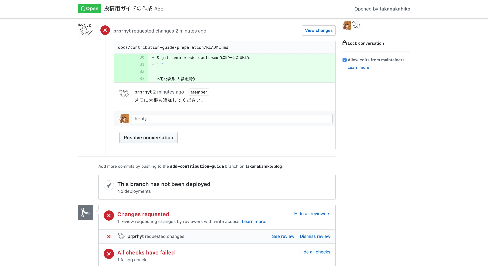
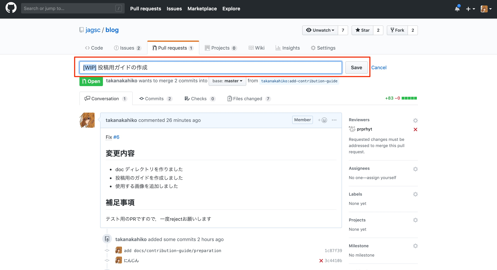
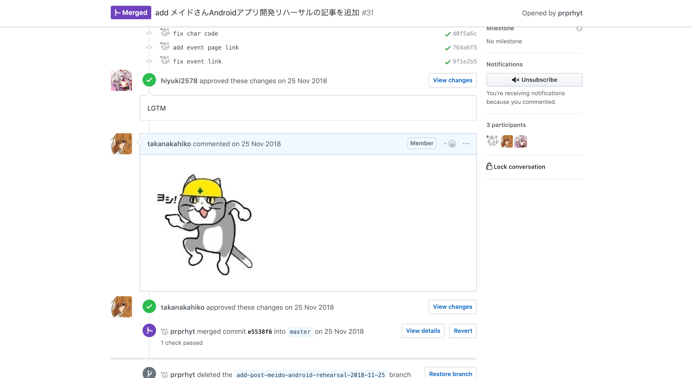

# Contribution Guide / プルリクエスト編

## はじめに

ブログをメンテナンス or 記事を執筆するにあたって，プルリクエストを送る必要があります．
プルリクエストを送る際に必要な手順を示します．

## 環境

適宜準備してください

- gitがインストールされている
- GitHubに登録している
- コマンドラインについて基本的な知識がある( `cd` や `ls` を扱える)

## 手順

## Fork元リポジトリに追従する

> clone後に**Frok元のリポジトリ**が変更された際に，手元のリポジトリの内容が古いものとなってしまいます．
> それを防ぐため，**Frok元のリポジトリ**に追従するようにします．

以下のコマンドを手元のターミナルで実行します．

```bash
# リポジトリ内に移動する
$ cd %リポジトリのパス%

# masterブランチに切り替える
$ git checkout master

# Fork元のリポジトリの情報を取得します
$ git fetch upstream

# Fork元のリポジトリの内容を手元に反映します
$ git merge upstream/master
```

これで，masterブランチの内容が最新のものになります．

## ブランチを作成する

作業する前に，その作業がわかりやすいような名前でブランチを作成します．(ぶっちゃけ名前はなんでも大丈夫です)

例えば，「見出しのタイトルを編集する」なら `change-heading-style`とかでしょうか

```bash
# ブランチを作成し，移動します．
$ git checkout -b %ブランチ名%
```

ブランチが切り替わったか確認してみましょう．

```bash
# ブランチが切り替わっているか確認します
$ git status
On branch %ブランチ名%
nothing to commit, working tree clean
```

## 作業を行う

実際に作業を行っていきます．

ファイルを編集後，コミットを行います．
ココらへんの解説はgit自体の説明になってしまうので省略します．

コミットは複数回になってしまっても大丈夫です．
作業内容が多い場合は複数回に分けるべきです．

```bash
$ git add %編集したファイルのパス%
$ git commit -m "%作業内容がわかりやすいコメント%"
```

## pushする

します

```bash
# pushします
$ git push 

# 上のコマンドがうまくいかなかったら
$ git push --set-upstream origin %ブランチ名%
```

## プルリクエストを作成する

**Fork元のリポジトリ**をブラウザで開きます．
正しくpushができていたら，以下のように「Compare & pull request」というボタンが有るはずです．
コレをクリックしてください．



次に，以下の画面に遷移するはずです．
画像の赤枠内で，「どのリポジトリのどのブランチから」「どのリポジトリのどのブランチへ」プルリクエストが送られるのか確認することができます．



次に，画面下部を確認します．
これらの項目には，今回の作業の情報を記載します．



下記画像のような感じで記載します．
「`fix #[Issueの番号]`」という部分は，このプルリクエストでどのIssueを解決するのか，番号で指定するようにしてください．
記述が終わったら「Create pull request」をクリックします．

(例の画像では変え忘れていますが，可能ならタイトル部分もわかりやすいように変更してください．)



## merge brockingの確認

作成されたプルリクエストを下にスクロールすると，以下のような記載があるはずです．



プルリクエストを実際に受け入れるには

- 2人以上の承認が必要
- CIrcleCIによるチェックの通過

が必要だという意味です．

ですから，Slackの `#prj-blog` チャンネルでレビューを依頼してください．暇な人がレビューするので，しばらく待ちます．

## レビューへの対応

> レビューには「Approval」と「Change request」があります．
> 「Approval」は「OK」といった意味です．
> 今回は「Change request」に対応する方法を確認しましょう．

レビューがされると以下のような記載があるはずです．
この例では，「メモ:帰りに人参を買う」というところを編集してください，といった感じですね．(ややこしいですが，この例の「メモに大根も追加してください。」は冗談です．)



今回の例で言うところのこのメモは，何かの拍子に間違えて書いてしまったのでしょう．
ということで，この部分を削除するように変更する必要がありそうです．

作業する場合は，プルリクエストのタイトルに「[WIP]」を追加しておくといいでしょう．
「Work In Progres」の略で，「今作業中だからレビューしなくていいよ」といった意味です．



プルリクエスト作成後にも，コミット内容は編集することができます．

そのまま手元のPCで，ファイルを編集して

```bash
$ git add %編集したファイルのパス%
$ git commit -m "%作業内容がわかりやすいコメント%"
$ git push
```

を行うだけです．
そうすると，勝手にプルリクエストの内容が更新されます．

作業が終わったら，プルリクエストのタイトルに付けた「[WIP]」は削除しておきましょう．

更新が終わったら，また次のレビューを待ちます．

## マージ

> レビューには「Approval」と「Change request」があります．
> 「Approval」は「OK」といった意味です．
> 「Approval」をもらった際の画面を確認しましょう．

レビューを通過したら，マージ(変更を取り入れる)することが可能になります．

以下のように，チェックマークのついたレビューが付いたら「Approval」という意味です．
（ちなみに「LGTM」は「いいとおもうよ」という意味です）



その後，レビューした人がマージするのを待ちましょう．

無事マージされたらあなたの作業内容が反映されているはずです！
お疲れ様でした．